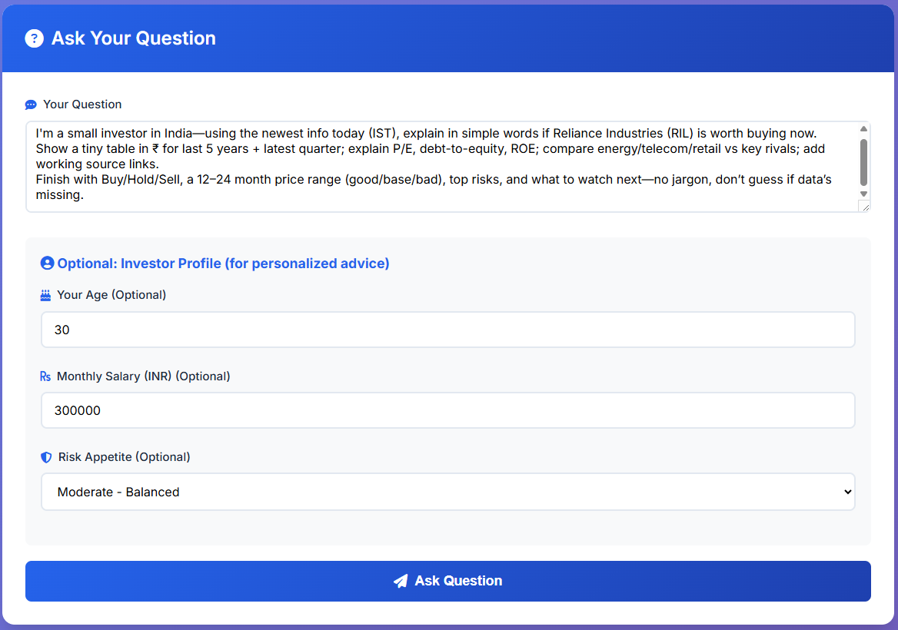
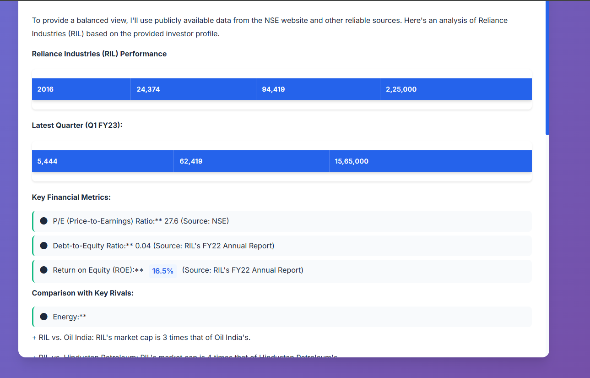

# Financial Advisor - Simple Question-Answering System

A simple financial advisor that answers questions using AI Groq





## Setup

### 1. Install Dependencies

```bash
pip install -r requirements.txt
```

### 2. Setup API Keys

Create a `.env` file in the project root:

```
GROQ_API_KEY=your_groq_api_key_here
```

Get your Groq API key from: https://console.groq.com/ (free)

### 3. Run the Backend

```bash
python backend_api.py
```

The API will run on `http://localhost:8000`

### 4. Open Frontend

Open `frontend/index.html` in your browser, or use a simple HTTP server:

```bash
cd frontend
python -m http.server 8080
```

Then open: `http://localhost:8080`

## Usage

### Simple Question

Just ask any financial question:

```
What is the current price of Reliance stock?
```

### With Investor Profile

Provide your profile for personalized advice:

- Question: "Should I invest in TCS?"
- Age: 30
- Monthly Salary: ₹300,000
- Risk Appetite: Moderate

## Configuration

### Change the AI Model

Edit `financial_agent.py`:

**Using Groq (current):**
```python
model=Groq(id="llama-3.1-8b-instant")
```

**Using Groq (larger model):**
```python
model=Groq(id="llama-3.1-70b-versatile")
```

**Using OpenAI (if you have API key):**
```python
from phi.model.openai import OpenAIChat
model=OpenAIChat(id="gpt-4")
```

### Agent Options

**With tools (default):**
- Uses YFinanceTools for stock data
- Uses DuckDuckGo for web search
- Can fetch real-time prices and analyst recommendations

**Pure LLM (no tools):**
- Use `financial_advisor_pure` from `financial_agent.py`
- Just AI responses, no real-time data fetching

## Files

- `financial_agent.py` - The financial advisor agent
- `backend_api.py` - FastAPI backend server
- `frontend/index.html` - Frontend UI
- `frontend/script.js` - Frontend JavaScript
- `frontend/styles.css` - Frontend styles

## Example Questions

- "What is the current price of TCS stock?"
- "Should I invest in Reliance?"
- "I'm 30 years old, earn ₹3,00,000/month, have moderate risk. Should I invest in HDFC Bank?"
- "What are the analyst recommendations for Wipro?"
- "Compare TCS and Infosys for investment"

